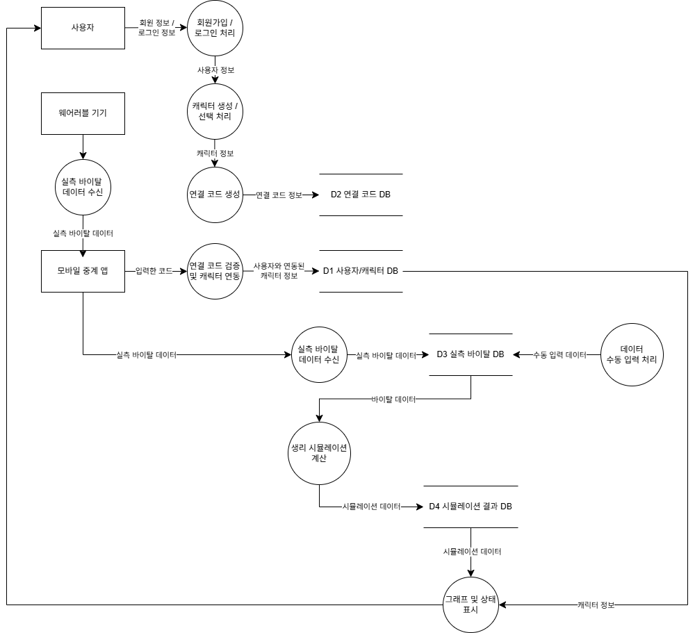
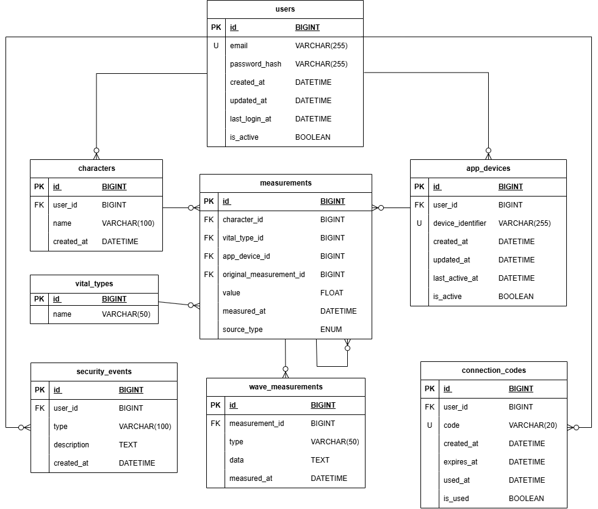

# VitaCore

Security-focused web platform for physiology-based vital simulation and visualization  

생리학 기반 바이탈 시뮬레이션 및 시각화를 위한 보안 중심 웹 플랫폼

---

## What is VitaCore?

VitaCore is a security-focused web platform that:

- Collects physiological data from wearable devices
> 웨어러블 기기로부터 생체 데이터를 수집
- Simulates vital signs based on biological models
> 생리학적 모델을 기반으로 바이탈을 시뮬레이션
- Visualizes real-time and simulated data
> 실시간 + 시뮬레이션 데이터를 시각화
- Tracks all changes using immutable data design
> 불변 데이터 구조로 모든 변경 이력 추적

Not just a data viewer, but a physiology-based simulation system.

---

## Motivation

VitaCore extends beyond traditional healthcare systems by:

- Integrating real-world and simulated physiological data  
> 실측 + 시뮬레이션 데이터 통합
- Providing educational insight into human body responses  
> 인체 반응 이해를 위한 교육적 가치
- Applying security concepts such as Zero Trust and data integrity  
> Zero Trust 및 데이터 무결성 적용

---

## Overview

VitaCore는 웨어러블 기반 실측 바이탈 데이터를 수집하여 생리학적 시뮬레이션을 수행하고,

이를 시각화하는 보안 중심(Web-based) 플랫폼이다.

### Core Goals

- 실측 데이터 + 시뮬레이션 데이터 통합 처리
- 데이터 변경 이력 추적 (Immutable Data Design)
- Zero Trust 개념 참고 검증 구조
- 의료 데이터 특성을 고려한 보안 설계

### Disclaimer

VitaCore는 의료 진단/치료 목적이 아닌,  
생리학 학습 및 시뮬레이션을 위한 시스템이다.

---

## 1. System Architecture (시스템 구조)
### 1.1 Data Flow Diagram (데이터 흐름도)

- Wearable → Mobile → Backend 구조
- 원본 데이터는 Measurement로 저장
- Backend에서 시뮬레이션 수행
- 결과만 사용자에게 시각화

### 1.2 ERD (엔터티 관계도)

#### DFD ↔ ERD Mapping

- users / characters → 사용자 영역
- connection_codes → 인증
- measurements → 원본 데이터
- simulation → source_type = 'simulation'

### 1.3 Tech Stack

- Frontend: React (Vite)
- Backend: Node.js + Express
- Database: MariaDB

### Design Principle

- 모든 데이터는 Backend API를 통해서만 접근
- 클라이언트에서 DB 직접 접근 차단
- 인증 및 권한 검증은 서버에서 일원화

→ Zero Trust 개념 참고 검증 적용

---

## 2. Core Domain (핵심 도메인)

각 도메인은 다음 역할을 가진다:

- User → 시스템 사용자 계정
- Character → 사용자별 생리 시뮬레이션 대상
- AppDevice → 연결된 모바일 또는 웨어러블 기기
- ConnectionCode → 기기 연결을 위한 1회성 인증 코드
- Measurement → 수치형 바이탈 데이터 (HR, SpO2 등)
- WaveMeasurement → 파형 데이터 (ECG 등)
- VitalType → 바이탈 종류 정의
- SecurityEvent → 인증 및 접근 관련 보안 로그
  
---

## 3. Database Physical Design (DB 물리 설계)
### Philosophy

- users / characters → 사용자 영역
- connection_codes → 인증
- measurements → 원본 데이터
- simulation → source_type = 'simulation'
  
### 3.1 users

| 컬럼 | 타입 | 설명 |
|------|------|------|
| id | BIGINT PK | 사용자 ID |
| name | VARCHAR(100) | 사용자 이름 |
| email | VARCHAR(255) UNIQUE | 이메일 |
| email_verified | BOOLEAN | 이메일 인증 |
| password_hash | VARCHAR(255) | bcrypt 해시 |
| created_at | DATETIME | 생성 시간 |
| updated_at | DATETIME | 수정 시간 |
| last_login_at | DATETIME | 마지막 로그인 |
| is_active | BOOLEAN | 활성 여부 |

### 3.2 characters

| 컬럼 | 타입 | 설명 |
|------|------|------|
| id | BIGINT PK | 캐릭터 ID |
| user_id | BIGINT FK | 사용자 ID |
| name | VARCHAR(100) | 캐릭터 이름 |
| age | INT | 캐릭터 나이 |
| gender | VARCHAR(20) | 캐릭터 성별 |
| height | DECIMAL(5,2) | 캐릭터 키 |
| weight | DECIMAL(5,2) | 캐릭터 몸무게 |
| created_at | DATETIME | 생성 시간 |

### 3.3 app_devices

| 컬럼 | 타입 | 설명 |
|------|------|------|
| id | BIGINT PK | 기기 ID |
| character_id | BIGINT FK | 캐릭터 ID |
| device_name | VARCHAR(100) | 기기 이름 |
| device_identifier | VARCHAR(255) UNIQUE | 기기 고유값 |
| created_at | DATETIME | 생성 시간 |
| updated_at | DATETIME | 수정 시간 |
| last_active_at | DATETIME | 마지막 접속 |
| is_active | BOOLEAN | 활성 여부 |

### 3.4 connection_codes

| 컬럼 | 타입 | 설명 |
|------|------|------|
| id | BIGINT PK | 코드 ID |
| character_id | BIGINT FK | 캐릭터 ID |
| code | VARCHAR(20) UNIQUE | 연결 코드 |
| created_at | DATETIME | 생성 시간 |
| expires_at | DATETIME | 만료 시간 |
| used_at | DATETIME | 사용 시간 |
| is_used | BOOLEAN | 사용 여부 |

### 3.5 vital_types

| 컬럼 | 타입 | 설명 |
|------|------|------|
| id | BIGINT PK | 타입 ID |
| type | VARCHAR(50) | 바이탈 종류 (HR, SpO2 등) |
| name | VARCHAR(50) | 바이탈 이름 (HR, SpO2 등) |

### 3.6 measurements

| 컬럼 | 타입 | 설명 |
|------|------|------|
| id | BIGINT PK | 측정 ID |
| character_id | BIGINT FK | 캐릭터 |
| vital_type_id | BIGINT FK | 바이탈 타입 |
| app_device_id | BIGINT FK | 기기 구분 |
| original_measurement_id | BIGINT FK | 원본 = NULL / 수정본 = 원본의 id |
| value | FLOAT | 측정 값 |
| measured_at | DATETIME | 측정 시간 |
| source_type | ENUM('device','simulation','manual') | 데이터 출처 구분 |
| created_at | DATETIME | 생성 시간 |

> source_type: 실측(device), 시뮬레이션(simulation), 수동 수정(manual)을 구분하기 위해 사용한다.

> 인증된 사용자 본인이 소유한 캐릭터의 데이터에 한해 manual 입력 가능하다.
>
> 정정 여부는 original_measurement_id 존재 여부로 판단한다.

### 3.7 wave_measurements

| 컬럼 | 타입 | 설명 |
|------|------|------|
| id | BIGINT PK | 파형 ID |
| measurement_id | BIGINT FK | 측정 ID |
| data | LONGTEXT | 파형 JSON |
| measured_at | DATETIME | 측정 시간 |

> measurements에서 파생된 표현 데이터

### 3.8 email_verification_tokens

| 컬럼 | 타입 | 설명 |
|------|------|------|
| id | BIGINT PK | 토큰 ID |
| user_id | BIGINT FK | 사용자 ID |
| token_hash | VARCHAR(255) | 인증 토큰 해시 |
| expires_at | DATETIME | 만료 시간 |
| used_at | DATETIME | 사용 시간 (NULL = 미사용) |
| created_at | DATETIME | 생성 시간 |

### 3.9 security_events

| 컬럼 | 타입 | 설명 |
|------|------|------|
| id | BIGINT PK | 이벤트 ID |
| email | VARCHAR(255) UNIQUE | 이메일 |
| type | VARCHAR(100) | 이벤트 종류 |
| description | TEXT | 상세 내용 |
| created_at | DATETIME | 생성 시간 |

---

## 4. Authentication Flow (인증 흐름)

1. Login (email + password)
2. bcrypt 검증
3. JWT 발급
4. 모든 요청 JWT 인증

### Zero Trust 개념 활용

- 모든 요청 인증 필수
- Stateless 구조
- 토큰 만료 정책

→ Zero Trust 개념 참고 검증 적용

---

## 5. Device Connection Flow (기기 연결 흐름)

1. 웹에서 연결 코드 생성
2. 모바일 앱에서 코드 입력
3. 서버에서 코드 검증
4. 기기 등록 후 활성화
5. 이후 바이탈 데이터 전송 가능

### Security Point

- 연결 코드는 1회성 + 만료 시간 존재
- 사용자 + 코드 + 기기 조합 검증
- 승인된 기기만 데이터 전송 가능
  
---

## 6. Security Design (보안 설계)
### 6.1 Basic Security

- Passwords are securely stored using bcrypt hashing
> 비밀번호는 bcrypt 해시를 통해 안전하게 저장된다
- JWT-based authentication with expiration policy ensures session security
> JWT 기반 인증과 만료 정책을 통해 세션 보안을 유지한다
- All communications are secured via HTTPS
> 모든 통신은 HTTPS를 통해 보호된다
- Unauthorized API access is strictly blocked
> 인증되지 않은 API 접근은 철저히 차단된다

### 6.2 Access Control

- Zero Trust-based authentication (continuous verification)
> Zero Trust 기반 인증 구조 (지속적인 검증)
- Device-based access control using AppDevice
> AppDevice를 활용한 디바이스 기반 접근 제어
- Inactive devices are automatically disabled after a certain period
> 일정 시간 이상 미사용된 디바이스는 자동 비활성화된다

### 6.3 Connection Security

- One-time connection codes prevent reuse attacks
> 1회용 연결 코드로 재사용 공격을 방지한다
- Data source tracking ensures authenticity and prevents spoofing
> 데이터 출처 추적을 통해 위변조 및 스푸핑을 방지한다

### 6.4 Logging and Audit

- All critical events are logged (SecurityEvent)
> 모든 주요 이벤트는 SecurityEvent로 기록된다
- Login attempts, failures, and device registrations are tracked
> 로그인 시도, 실패, 디바이스 등록 등의 활동을 추적한다
- Enables auditability and anomaly detection
> 감사(Audit) 및 이상 탐지 기반을 제공한다
- Lightweight algorithm-based anomaly detection
> 경량 알고리즘 기반 이상 탐지 구조를 고려한다
- Security policy design is implemented based on CSAP guidelines
> CSAP 기준을 참고한 보안 정책 설계를 반영한다

---

## 7. Data Integrity (데이터 무결성)

- 원본 데이터는 수정하지 않음
- 수정 시 새로운 레코드 생성
- 데이터 출처(source_type)로 구분

→ 데이터 위변조 방지 및 이력 추적 가능

---

## 8. REST API Design

백엔드 구현 이후, 실제 API 기반으로 정정 기재할 예정

---

## 9. Implementation Rules (구현 규칙)

- DB 접근은 Backend only  
- FK 무결성 유지  
- 인증 없는 접근 금지  
- 모든 주요 이벤트 로그 기록 

---
## 10. Naming Convention (명명 규칙)
### Table Naming
- 모든 테이블은 소문자(snake_case)를 사용
- 테이블명은 복수형으로 정의

### Identifier (ID)
- 모든 식별자(id, *_id)는 BIGINT 타입을 사용
- PK와 FK는 동일한 타입으로 유지

### Timestamp
- 시간 컬럼은 _at 형식을 사용

---

